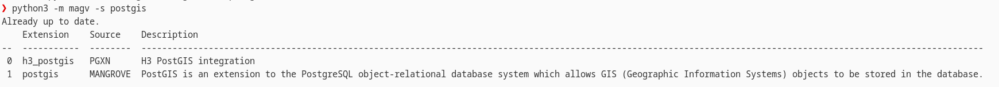
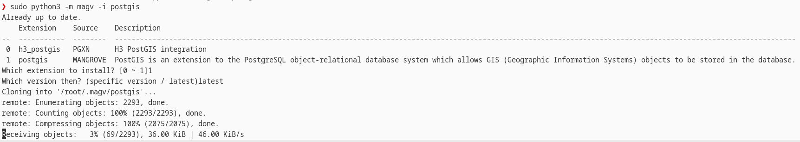
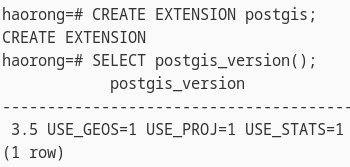

## Mangrove - PostgreSQL 插件管理器

Mangrove 是一个用于下载安装 PostgreSQL 插件的命令行工具，你可以用它下载 [PGXN](https://pgxn.org/) 或 [Mangrove Index](https://atomgit.com/haorongxu/magv-index) 支持的插件.

## 安装

你可以从 [Github](https://github.com/HaorongX/magv/), [AtomGIT](https://atomgit.com/haorongxu/magv) 上取得本项目的源码。下面的指令将从 [PyPI](https://pypi.org/project/magv/) 将 Mangrove 安装到您的系统中。
```
pip3 install magv
```

随后请执行 `python3 -m magv' 和 `sudo python3 -m magv` 初始化本应用。如果您操作正确，如下的警告信息应该会出现在终端中。
```
WARNING: YOU SHOULD CHANGE YOUR CONFIGURE FILE MANUALLY AT ~/.magv/config.json TO USE MANGROVE
```

#### 更新

请通过 `pip3 install magv --upgrade` 更新本程序. 请注意，如果你使用镜像 PyPI 源，将有可能不能更新到最新版本。

## 使用说明

> Tips: 你可以通过 `magv -h` 查看使用说明

### 搜索插件

```
python3 -m magv -s/--search [extension]
```
该指令将返回一个列表，包括 PGXN 和 MANGROVE-INDEX 中所有根据给出名字检索到的插件，如下图所示。


### 下载插件

```
python3 -m magv -d/--download [extension]
```
就像搜索插件时一样，您仍然会看到一系列插件。从中选择您要安装的一个并指定版本号（可以是具体版本或者用 `latest` 获取最新版本）即可，下载的插件存储在 `~/.magv` 中。

### 安装

```
sudo python3 -m magv -i/--install [extension]
```
该命令几乎与下载插件一样，只不过插件的 `autogen.sh`, `configure`脚本, `Makefile` 将被自动运行以安装插件。同时也可以通过 `-p [path to extension]` 制定从本地的文件夹安装。请注意用合适的用户运行程序。如果您使用了非 `root` 用户，程序将给出警告。如果您使用 root 用户，也请为其配置好环境变量。尽量用同一个用户进行下载和安装以避免潜在的问题。


